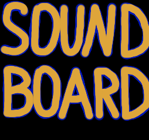

# Soundboard

<p align="center">
  
</p>

<p align="center">
  <strong>Windows desktop soundboard</strong> - load local audio, bind pads &amp; hotkeys, play into Discord voice chat.
</p>

<p align="center">
  
  
</p>

---

## Features

- Play **MP3, WAV, OGG, FLAC, M4A, AAC, WMA, AIFF**
- Add files, folders, or drag & drop
- Global hotkeys (work in the background)
- Per-pad volume + master volume (live while playing)
- Dual output: **Discord virtual cable** + local monitor
- Overlap sounds or play one at a time
- Settings saved to `%AppData%\SoundboardApp\`
- Windows 11–friendly MSI installer (self-contained, no .NET on target PC)

## Discord setup

Soundboard cannot inject audio into Discord directly. Use a virtual cable:

1. Install **[VB-Audio Virtual Cable](https://vb-audio.com/Cable/)** (free).
2. In Soundboard:
   - **Discord output** → `CABLE Input`
   - **Monitor** → your headphones / speakers
3. In Discord → **Settings → Voice & Video → Input Device** → `CABLE Output`.
4. Turn down / off Discord **AGC**, **Noise Suppression**, and **Echo Cancellation** (they can duck samples).

```
[Soundboard] ──► CABLE Input ──► CABLE Output ──► Discord (mic)
       │
       └──► headphones (monitor)
```

Without a virtual cable the app still plays locally; Discord will not hear it.

## Requirements

| | Build machine | Target PC (installed MSI) |
|---|---|---|
| OS | Windows 10/11 x64 | Windows 10/11 x64 |
| .NET | [.NET 10 SDK](https://dotnet.microsoft.com/download) | **Not required** (self-contained) |
| WiX | `dotnet tool install -g wix` (for MSI only) | - |
| Discord | Optional | [VB-Cable](https://vb-audio.com/Cable/) recommended |

## Quick start (development)

```bash
git clone https://github.com/Alok2221/SoundBoard.git
cd SoundBoard
dotnet restore
dotnet run --project SoundboardApp.csproj
```

## Build MSI installer

```powershell
dotnet tool install -g wix   # once
powershell -ExecutionPolicy Bypass -File .\build-msi.ps1
```

Output: [`dist/SoundboardSetup.msi`](dist/SoundboardSetup.msi) (created locally; not committed).

Install:

```powershell
msiexec /i .\dist\SoundboardSetup.msi
```

Installs to `Program Files\Soundboard` with Start Menu + Desktop shortcuts.

## Project structure

```
SOUNDOARD_APP/
├── SoundboardApp.csproj      # WPF app
├── MainWindow.xaml(.cs)      # UI
├── ViewModels/               # MVVM
├── Services/                 # Audio, hotkeys, settings, devices
├── Models/
├── Themes/                   # Dark UI styles
├── resources/                # App icon
├── installer/                # WiX MSI project
├── build-msi.ps1             # Publish + build MSI
├── LICENSE
└── README.md
```

## Hotkeys

| Action | How |
|--------|-----|
| Play | Click ▶ or use the pad hotkey |
| Set hotkey | Pad hotkey button → press combo |
| Cancel | `Esc` while capturing |
| Stop all | **Stop** |

Allowed global shortcuts: **F1–F24**, or any combo with **Ctrl / Alt / Shift**. Bare letters are blocked so they don’t steal typing from other apps.

## Security (Windows 11)

- Runs as a normal user (`asInvoker`) - no admin elevation
- Does **not** use the microphone (output devices only; Discord needs mic permission for the cable)
- Writes settings only under `%AppData%\SoundboardApp\`
- If Defender **Controlled Folder Access** blocks your sound folders, add an exception

## Tech stack

- C# / WPF / .NET 10
- [NAudio](https://github.com/naudio/NAudio) + NAudio.Vorbis
- CommunityToolkit.Mvvm
- WiX Toolset 5 (installer)

VB-Audio Virtual Cable is a separate third-party product; install it from [vb-audio.com](https://vb-audio.com/Cable/).
